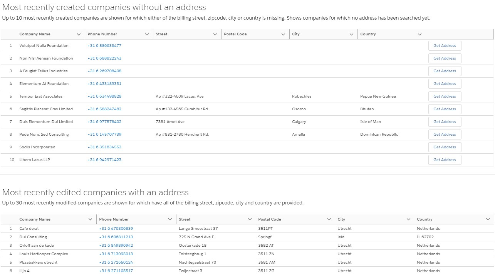

# Salesforce Account Address Manager
This repository holds a solution for the following user story, used to manage company addresses in a Salesforce Lightning Web Component.

## User Story
As a user I want to be more in control of companies that do not have address. I want to easily access them, update and have an overview over which of them have and which don’t have addresses.

I want to be able to have an overview of 2 things:
1. Last 10 created companies without an address
2. Last 30 modified companies which do have an address.

Information which I want to see is on each record is:
1. Company name
2. Company phone number
3. Company address.

For each company from the list that does not have an address, I want to be able to easily retrieve an address. When retrieving an address, I expect 2 things can happen:
1. Record is updated with an address and it disappears from the list of companies without an address and appears in the list of the last modified companies who have an address
2. If there is no address to retrieve, I want to be notified there is no available address and company should disappear from the list of companies without an address.

## How does it work?
- Harness the LWC by putting it on a lightning page using the app builder.
- The component loads most recently created companies without an address, and most recently modified companies with an address. For companies without an address, you can hit the button `Get Address` to search for the  address based on the company name, using the Google Places Place Search API. If it's found, it's updated. Companies that have already had an address search, don't appear in the component.
- Currently, it has been built to work in Dutch address locale, retrieved by the Google Places API place search. This means that the Street, Postal Code, City and Country will be retrieved when a Dutch address format is retrieved. To try out correct use, try a company with a Dutch name.

## Technical implementation:
- As technology, I used Lightning Web Components for displaying a page with 2 Account lists.
- To retrieve an address based on the Account name. I used the [Google Places API](https://developers.google.com/places/web-service/search), which callout is put on the button next to each record in the list.
- Used Apex Enterprise Patterns as Apex code framework, and an Application class as an injection framework

## Considerations & things to note
- In the developer org, the LWC has been exposed in the lightning app 'Company Address Manager'.
- Git: worked directly into master. If i'd work with multiple people, I'd work in a feature branch and have my PR reviewed before merging.
- I added fflib as classes in the org, but not in the git repo. In a proper DX project, i'd put them in a separate directory. In the existing codebase of an org you'd probably have them as an unmanaged package somewhere.
- As the google place api is not 'bulkified' (i.e. you can only fire a request for one location, I couldn't directly find a way to fire a request with multiple locations in a request body in [the documentation](https://developers.google.com/places/web-service/search)), I went with a button lightning data table per row, and didn't allow multiple rows to be selected in order to get the location, which might provide a better user experience.
- I've made an assumption that an address consists of the Street, Postal Code, City and Country. If one of these fields are empty, the Company Address is considered to not have an address.
- Use named credentials to store the Google Places API key, instead of custom settings. I couldn't directly find a way to use the API key in the request header in the Google Places API documentation. Another way would have been to  set up Oauth, but that is quite some work at this time so I'm taking this shortcut in order to be able to finish this in a reasonable amount of time.
- The Google Places API Place Search turned out only to provide a formatted address, not individual address fields, which is what I erroneously hoped for. It's possible to do another callout to the Place Details API using the ID from the first request, but then still you'd have to deal with locational differences in address formats. A simplification could have been to create a separate address field as a textfield on the account, or an alternative might be to use the geolocation returned by the Google API, and then have Salesforce find an address for it. For simplification, I'm assuming the response from the google api applies to Dutch companies, and i'll split the response and update individual address fields. For simplicity, I also used the 1st match that google returned.
- Regarding the use of design patterns: it might be debatable whether a controller should control further processing of the account record after having made the  call to the GooglePlacesService, or whether the GooglePlacesService should be responsible for further handling the update. For Single Responsibility purposes, I chose not to have the GooglePlacesService further process the account record. It might have been good to make a separate service for handling the account after retrieving the google response. Here comes the debate: it could be the responsibility of the controller as well.
- I couldn't get 2 assertions to pass in CompanyAddressManagerControllerTest. After spending too much time on this, I decided to skip them. The code works, and I'm running into issues with the mocking framework.

## Suggestions for improvement
- [X] Be able to declaratively determine the max number of records you want to display in the component for companies with or without an address, in the app builder.
- [X] Different styled message for 'no address found': make it a warning.
- Make it a DX project to improve the file structure & more easily add dependencies.
- Add info tags to table headers instead of text underneath to describe the table contents: use LWC LDS Tooltips.
- Make selection available on the component of the field the user can use to retrieve the companies, along with the sorting order, such as 'LastModifiedDate' and 'Ascending'. Also add a 'refresh' button.
- Display the address fields as a LWC formatted address.
- Add custom labels for titles, columns names, errors.
- Make account name clickable. How? -> [link](https://salesforce.stackexchange.com/questions/257065/hyperlink-record-name-lwc-datatable).
- In hindsight, 2 different components might be more fitting since they can then indivdiually be re-used. The 'without' address component could then ommit an event to rerender the 'with address' component after retrieving an address.
- Make company name editable in datatable.
- Test JavaScript code using Jest.
- Use OAuth instead of an api key.

## Prerequisites for using this implementation
- [FFLib ApexMocks](https://github.com/apex-enterprise-patterns/fflib-apex-mocks) and [FFLib Apex Common](https://github.com/apex-enterprise-patterns/fflib-apex-common) (these are not included in respository).
- Set up the use of the [Google Places API](https://developers.google.com/places/web-service/search):
  - Add `maps.googleapis.com` to the Remote Site Settings
  - Configure the API key in the (hierarchiy) custom settings `GooglePlacesAPI__c` in a field called `Key__c` as org defaults.